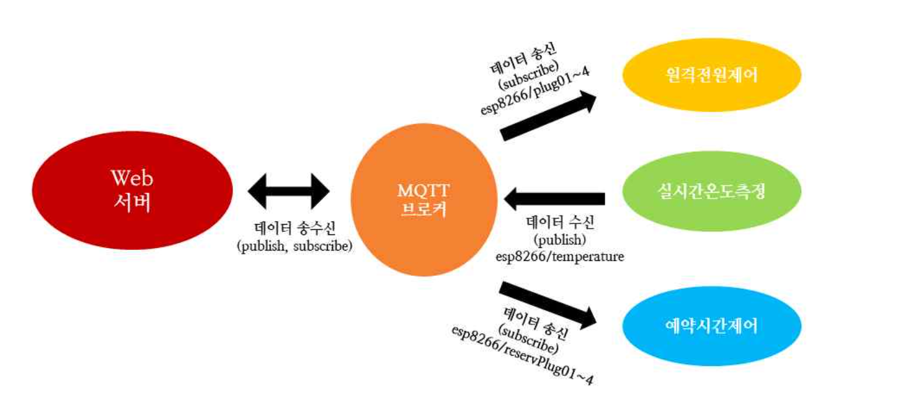
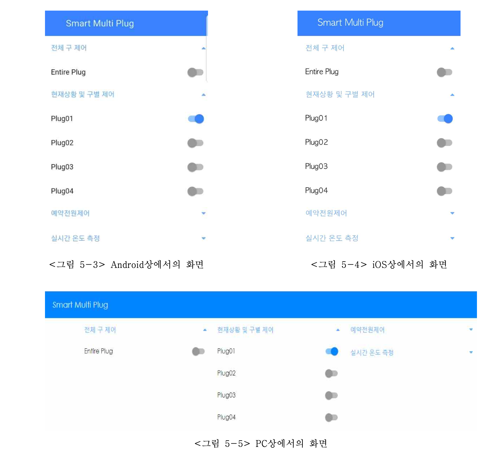

### 1) 요구사항

 
 

1. 4구 이상의 멀티탭

2. 웹으로 호스팅 된 제어페이지를 이용해 어디서나 원격제어 가능

3. 타이머 기능

4. 멀티탭 내부의 온도가 일정 온도 이상으로 올라갈 경우 자동으로 전원차단

 
 
 

 
 
 

### 2) 스마트멀티탭 하드웨어 설계도

 
 

 
 
 

### 3) 스마트멀티탭 소프트웨어 구현 설계

 
 

 
 
 

### 4) 구현 결과

 
 

 
 
 

### 5) 수상 결과
- 교내 캡스톤 경진 대회 우수상
- 한학기 내내 동기 및 후배를 대상으로 IOT 강의 

